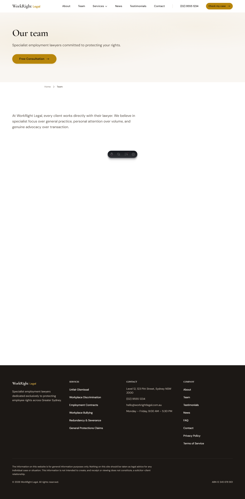

# WorkRight Legal — Content Editor Guide

## Before you read anything else

This guide is for the people who will edit the WorkRight Legal website. Unlike a traditional WordPress or Payload CMS site, WorkRight Legal does not have an admin panel. Content lives in plain text Markdown files that you edit with Visual Studio Code or GitHub's web editor.

If that sounds scary, do not worry. Editing a Markdown file is easier than formatting a Word document. This guide will walk you through everything.

By the end of this guide you will be able to:

- Open the project in VS Code (or the GitHub web editor) and find the right file
- Edit an existing practice area, news article, or attorney profile
- Add new content by copying an existing file
- Handle images and links
- Preview your changes before they go live
- Publish changes to the live site with one commit
- Roll back if something goes wrong
- Work without breaking anything else

### Who this guide is for

- **Publishers** who have direct edit access to the main branch
- **Contributors** who draft changes for someone else to review
- **Reviewers** who review and merge draft changes before they go live

### Document conventions

- Numbered steps `(1) (2) (3)` must be followed in order.
- `Monospace text` means something you type or copy.
- A box with a lightning bolt is a tip.
- A box with a warning triangle can break the site.
- A box with a red stop sign can lose data or damage the live site.

---

## Part 1: How this site is structured

A normal CMS keeps content in a database and lets you edit it through a web page. This site keeps content in files and lets you edit it with any text editor. The advantages are:

- The content is readable, versioned, and portable.
- No database means no backup, no migration, and no runtime cost.
- Changes go through Git, so nothing is ever lost.
- The same file format (Markdown) is the industry standard for technical writing.

The disadvantages are:

- You need to be comfortable editing plain text.
- There is no WYSIWYG editor.
- Adding a new field requires a developer to update the schema.

### 1.1 Where every kind of content lives

The entire website is organised into content collections. Each collection is a folder of Markdown files under `src/content/`.

| Collection | Folder | What it is for |
|---|---|---|
| **Practice areas** | `src/content/practice-areas/` | One file per practice area (unfair dismissal, workplace discrimination, etc.) |
| **Attorneys** | `src/content/attorneys/` | One file per attorney profile |
| **News articles** | `src/content/news/` | One file per blog article |
| **Case results** | `src/content/case-results/` | One file per case result |
| **Testimonials** | `src/content/testimonials/` | One file per client testimonial |

Plus firm-wide information in a single TypeScript file:

- `src/data/firm.ts` — Business name, address, phone, email, social links

And site pages in Astro component files:

- `src/pages/*.astro` — Individual page layouts (About, Contact, Home, etc.)

For most day-to-day editing, you will only touch files under `src/content/` and `src/data/firm.ts`.

### 1.2 The anatomy of a Markdown file

Every Markdown content file has two parts.

**Part 1: Frontmatter.** A YAML block at the top, between `---` lines. This is where structured fields live (title, slug, date, etc.).

**Part 2: Body.** Everything below the second `---`. This is the main content, written in Markdown.

Example from `src/content/practice-areas/unfair-dismissal.md`:

```markdown
---
title: "Unfair Dismissal"
slug: "unfair-dismissal-lawyers-sydney"
description: "Fight unfair dismissal with Sydney's top-rated employment lawyers."
heroHeading: "Dismissed unfairly? You have 21 days to act."
heroSubheading: "We can help you fight back and get the compensation you deserve."
order: 1
icon: "⚖️"
---

# Body content in Markdown

This is the rich content that appears on the page. You can use **bold**,
*italic*, [links](https://example.com), and:

- Bullet lists
- Numbered lists
- Images
- Quotes

## Subheadings become H2

And so on.
```

> NOTE: Practice area slugs use SEO-optimised format (e.g. `unfair-dismissal-lawyers-sydney`). Pages are served at `/services/[slug]`, not `/practice-areas/`.

---

## Part 2: Setting up your editor

The recommended editor is Visual Studio Code. It is free, cross-platform, and has the best support for Markdown and Astro.

### 2.1 Installing VS Code

(1) Go to `https://code.visualstudio.com`.
(2) Download the installer for your operating system.
(3) Run it with default options.
(4) Launch VS Code.

### 2.2 Opening the project

(1) In VS Code, pick **File** → **Open Folder**.
(2) Navigate to the project folder (e.g. `C:\Users\yourname\Projects\workright-legal`).
(3) Click **Select Folder**.
(4) You should see the project structure on the left.

### 2.3 Useful VS Code settings

Open **File** → **Preferences** → **Settings** and tweak these:

- **Word wrap**: on. This makes long Markdown lines easier to read.
- **Format on save**: on. This auto-fixes indentation.
- **Files: Auto Save**: `onFocusChange`. This saves automatically when you click away from a file.

### 2.4 Recommended extensions

Install these from the Extensions sidebar (square icon on the left):

- **Astro** by Astro Build — Syntax highlighting for .astro files
- **YAML** by Red Hat — Catches errors in frontmatter
- **Markdown All in One** — Shortcuts for Markdown formatting
- **Code Spell Checker** — Finds typos as you type

### 2.5 If you do not want to install VS Code

You can edit files directly on GitHub using the built-in web editor. See Part 8 for the full GitHub web editor workflow. It is slower than VS Code but works from any computer.

---

## Part 3: Editing an existing page

This is the most common task. The walkthrough below edits the unfair dismissal practice area page.

### 3.1 Step-by-step walkthrough

(1) Open the project in VS Code.
(2) In the left sidebar, expand `src/content/practice-areas/`.
(3) Click `unfair-dismissal.md` to open it.
(4) The file opens in the main editor area.
(5) Find the field you want to change.
(6) Edit the value, keeping the field structure intact.
(7) Save with `Ctrl` + `S`.

That is it. If the dev server is running (`npm run dev`), the browser reloads automatically and your change is visible within 500 milliseconds.

### 3.2 A concrete example

Say you want to change the hero heading for the unfair dismissal page.

Before:

```yaml
heroHeading: "Fair Outcomes for Unfair Dismissal"
```

After:

```yaml
heroHeading: "Protecting Your Rights When You Have Been Wrongly Dismissed"
```

Save the file. The browser updates.

> TIP: If you break the YAML syntax (forget a quote, use a colon where you should not), the dev server will show a clear error in the terminal and the browser. Read the error, fix the typo, save again.

### 3.3 Rich text editing rules

The body content uses Markdown. The most useful syntax:

| What you want | How to write it |
|---|---|
| **Bold** | `**bold**` |
| *Italic* | `*italic*` |
| Heading 2 | `## Heading text` on a new line |
| Heading 3 | `### Heading text` on a new line |
| Bullet list | `- item` on each line |
| Numbered list | `1. item` on each line |
| Link | `[link text](https://example.com)` |
| Image | `` |
| Quote | `> quoted text` |
| Horizontal rule | `---` on a new line |
| Inline code | `` `code` `` |
| Code block | Triple backticks on their own line, then the code, then triple backticks again |

### 3.4 What not to do

- Do not change the order of frontmatter fields unless you know what you are doing.
- Do not remove required fields. The build will fail and you will get a scary error.
- Do not edit the closing `---` line of the frontmatter. It marks where frontmatter ends and body begins.
- Do not paste content directly from Microsoft Word. Word inserts hidden characters that break Markdown.
- Do not use tabs inside YAML. Always use spaces.

---

## Part 4: Adding a new practice area

Adding a new page is always easier if you copy an existing one and modify it.

### 4.1 Step-by-step

(1) In VS Code, right-click `src/content/practice-areas/unfair-dismissal.md` and pick **Copy**.
(2) Right-click the `practice-areas` folder and pick **Paste**.
(3) A duplicate file appears with a new name.
(4) Right-click the duplicate and pick **Rename**.
(5) Give it a new filename using lowercase letters and hyphens: `redundancy-disputes.md`.

> WARNING: The filename MUST use lowercase letters, hyphens, and end in `.md`. Spaces, capital letters, and underscores will break the URL generation.

(6) Open the new file.
(7) Change every value in the frontmatter to match the new practice area.
(8) Change the slug to an SEO-optimised format: `redundancy-disputes-lawyers-sydney`.
(9) Change the `order` field to a unique number (this controls the display order).
(10) Replace the body content.
(11) Save.

The new page appears automatically at `/services/redundancy-disputes-lawyers-sydney`.

> TIP: You also need to add the new practice area to the `practiceAreasList` array in `src/data/firm.ts` for it to appear in navigation and listing sections.

### 4.2 Required frontmatter fields

Every practice area must have:

- `title` — Displayed in the header and hero
- `slug` — The URL segment (use SEO format like `unfair-dismissal-lawyers-sydney`)
- `description` — Short description for listings
- `metaTitle` — SEO title (under 60 characters)
- `metaDescription` — SEO description (120-158 characters)
- `heroHeading` — The big headline on the page
- `heroSubheading` — Supporting text below the headline
- `order` — Display order (lower numbers appear first)
- `icon` — Emoji icon (e.g. `⚖️`)
- `ctaText` — Call-to-action button text

Optional but recommended:

- `stats` — Array of statistics to highlight (with `value` and `label`)
- `keyFacts` — Array of important bullet points
- `process` — Array of process steps
- `faqs` — Array of question/answer pairs

### 4.3 FAQ format

FAQs are a major part of practice area pages. Format them like this:

```yaml
faqs:
  - question: "What counts as unfair dismissal?"
    answer: "Unfair dismissal occurs when an employer terminates an employee
      in a harsh, unjust, or unreasonable way. The Fair Work Act defines
      this test, and the Fair Work Commission applies it on a case by case
      basis."
  - question: "What is the time limit to file?"
    answer: "You have 21 days from the date of dismissal to file an unfair
      dismissal claim with the Fair Work Commission. This is a strict
      deadline. If you miss it, you usually cannot bring a claim at all."
```

Keep answers between 60 and 130 words. Short answers rank better in AI answer engines like ChatGPT and Google's AI Overviews.

---

## Part 5: Writing a news article

News articles live in `src/content/news/`.

### 5.1 Step-by-step

(1) Copy an existing article, for example `src/content/news/new-unfair-dismissal-laws-2025.md`.
(2) Rename the copy to match your new article slug, e.g. `2026-workplace-bullying-reforms.md`.
(3) Update the frontmatter:
   ```yaml
   ---
   title: "2026 Workplace Bullying Reforms Explained"
   slug: "2026-workplace-bullying-reforms"
   description: "What the new workplace bullying laws mean for Sydney employees."
   date: 2026-04-12
   author: "Sarah Mitchell"
   category: "Workplace Bullying"
   image: "../../assets/news/bullying-reforms-hero.jpg"
   metaTitle: "2026 Workplace Bullying Reforms Sydney — WorkRight Legal"
   metaDescription: "The 2026 workplace bullying reforms explained for Sydney employees."
   ---
   ```
(4) Write the article body in Markdown.
(5) Save.

### 5.2 Best practices for articles

- **Start with the answer.** The first paragraph should tell the reader what they will learn.
- **Use Q-and-A subheadings.** `## What are the new reforms?` followed by a direct answer ranks well in AI search.
- **Include real numbers.** "A 47 percent increase" is more credible than "a significant increase".
- **Quote real sources.** Link to the Fair Work Commission, relevant legislation, or news reports.
- **Add a call to action.** Every article should end with a clear next step (e.g. "Book a free consultation").
- **Keep paragraphs short.** Two to four sentences. Three or more lines of text looks like a wall to the reader.

### 5.3 Article images

Put new images in `src/assets/news/`. Reference them in Markdown like this:

```markdown

```

The `../../` moves up two folders from the news article to reach the assets folder. Always include alt text.

---

## Part 6: Managing attorney profiles

Attorney profiles live in `src/content/attorneys/`.



### 6.1 Adding a new attorney

(1) Get the attorney's headshot (square, 800 x 800 minimum, plain background).
(2) Save it to `src/assets/attorneys/first-last.jpg`.
(3) Copy an existing attorney file.
(4) Rename it `first-last.md` (lowercase, hyphens).
(5) Update the frontmatter:
   ```yaml
   ---
   name: "Priya Sharma"
   slug: "priya-sharma"
   title: "Senior Associate"
   image: "../../assets/attorneys/priya-sharma.jpg"
   credentials: "LLB (Hons), GDLP"
   education:
     - "University of New South Wales, LLB (Hons), 2016"
     - "College of Law, GDLP, 2017"
   barAdmissions:
     - "Supreme Court of New South Wales, 2017"
     - "High Court of Australia, 2019"
   yearsExperience: 9
   philosophy: "Every client deserves to have their story heard with
     patience and respected with action."
   metaTitle: "Priya Sharma — Senior Associate, WorkRight Legal"
   metaDescription: "Senior Associate Priya Sharma specialises in unfair
     dismissal, workplace discrimination, and employment contracts..."
   ---
   ```
(6) Write a longer biography in the body of the file.
(7) Save.

### 6.2 Removing an attorney

Never delete an attorney file if they have authored news articles. The byline on those articles depends on the attorney existing.

Instead:

(1) Open the attorney file.
(2) Add a frontmatter field `archived: true`.
(3) Optionally add `departureDate: 2026-05-15`.
(4) Save.

The build will hide the attorney from the current roster but keep the file for historical attribution.

---

## Part 7: Managing firm-wide information

Firm-wide data (name, address, phone, email, social links, service areas) lives in one file: `src/data/firm.ts`.

### 7.1 Opening the firm file

In VS Code, press `Ctrl` + `P` and type `firm.ts`. Pick the file.

### 7.2 Editing

The file exports a single object called `firmData`. Every page and component on the site reads from this object, so changing a value here updates the entire site at once.

```typescript
export const firmData = {
  name: "WorkRight Legal",
  tagline: "Fighting for workers' rights across Greater Sydney",
  phone: "(02) 9555 1234",
  phoneClean: "0295551234",
  secondaryPhone: "1300 123 456",
  email: "hello@workrightlegal.com.au",
  address: {
    street: "Level 12, 123 Pitt Street",
    city: "Sydney",
    state: "NSW",
    postcode: "2000",
    country: "Australia",
    full: "Level 12, 123 Pitt Street, Sydney NSW 2000",
  },
  hours: "Monday – Friday, 9:00 AM – 5:30 PM",
  serviceArea: "Greater Sydney",
  serviceRadius: "100km from Sydney CBD",
  foundedYear: 2009,
  domain: "workrightlegal.vercel.app",
  url: "https://workrightlegal.vercel.app",
  social: {
    linkedin: "",
    facebook: "",
    twitter: "",
  },
  serviceAreas: [
    "Sydney CBD",
    "North Sydney",
    "Parramatta",
    // ...more suburbs
  ],
};
```

Change any value, save the file, and every page on the site that reads that value updates automatically. `phoneClean` is the digits-only version used inside `tel:` links and should always match `phone` without spaces or brackets.

The same file also exports a `practiceAreasList` array with the name, slug, short description, and icon key for each practice area. If you add a new practice area content file, you also need to add it to this list for it to appear in navigation menus and listing sections.

Location data for suburb-specific service pages lives in a separate file: `src/data/locations.ts`.

> WARNING: Keep the quotes and commas exactly where they are. If you remove a comma or close a brace in the wrong place, the build will fail.

---

## Part 8: Editing through the GitHub web editor

If you do not have VS Code installed or you are editing from a computer that is not yours:

(1) Go to `https://github.com/jamessuuu/workright-legal`.
(2) Sign in.
(3) Navigate to the file you want to edit (for example `src/content/practice-areas/unfair-dismissal.md`).
(4) Click the pencil icon in the top-right of the file view.
(5) The file opens in an online editor.
(6) Make your changes.
(7) Scroll to the bottom of the page.
(8) Write a short description of what you changed in the commit message box.
(9) Choose one of:
   - **Commit directly to the main branch** (publishes immediately)
   - **Create a new branch and pull request** (your changes wait for a reviewer)
(10) Click **Commit changes**.

If you committed directly, Vercel rebuilds the site within two minutes. If you created a pull request, a reviewer merges it, then Vercel rebuilds.

### 8.1 When to use the web editor

- You only have a phone or tablet handy.
- You are at a client's office with no VS Code.
- You only need to fix a typo.
- You are making a small one-off change.

### 8.2 When NOT to use the web editor

- You are making multiple related changes across many files. Use VS Code.
- You need a preview before committing. Use VS Code with `npm run dev`.
- You are not confident in YAML syntax. The web editor has weaker validation.

---

## Part 9: Previewing changes

### 9.1 Local preview with VS Code

(1) Open a terminal in VS Code (**Terminal** → **New Terminal**).
(2) Run `npm run dev`.
(3) Open `http://localhost:4321` in your browser.
(4) Every edit you save in VS Code appears in the browser within half a second.

### 9.2 Preview deployments on Vercel

If you create a pull request on GitHub, Vercel automatically creates a preview deployment with its own unique URL. The URL is posted as a comment on the pull request.

This is the safest way to let teammates review changes before they go live.

### 9.3 Production

Every commit that lands on the `main` branch triggers a production deployment. It is live within two minutes.

---

## Part 10: Rolling back a change

Mistakes happen. Rolling back is fast.

### 10.1 Undoing a commit before it is pushed

In VS Code:

(1) Open the Source Control sidebar.
(2) Find the most recent commit.
(3) Right-click and pick **Undo Last Commit**.
(4) The commit is removed but your changes stay in the file.
(5) Fix the problem, then commit and push.

### 10.2 Reverting a commit after it is pushed

In VS Code:

(1) Open the Source Control sidebar.
(2) Click the three-dot menu at the top.
(3) Pick **Git Graph** (or use `git log`).
(4) Right-click the bad commit and pick **Revert**.
(5) A new commit is created that undoes the bad one.
(6) Push. Vercel redeploys. The site is fixed.

### 10.3 Rolling back a production deployment

The fastest fix when production is broken:

(1) Open the Vercel dashboard.
(2) Go to **Deployments**.
(3) Find the last known good deployment (green check mark).
(4) Click the three-dot menu next to it.
(5) Pick **Promote to Production**.
(6) Rollback takes about 10 seconds.

This does not fix the bad commit in the repository. It just temporarily restores the previous version until you fix the commit.

---

## Part 11: Accessibility, devices, and special cases

### 11.1 Always include alt text

Every image must have alt text describing what it shows. Screen readers read it out. Search engines use it to rank images. Never skip this.

Good alt text:

- "Attorney Sarah Mitchell sitting at a desk in the Sydney office"
- "Scales of justice balancing a contract and a gavel"

Bad alt text:

- "image"
- "photo"
- "click here"
- (empty)

### 11.2 Heading hierarchy

Every page has exactly one H1, which is usually the page title. Use H2 for main sections. Use H3 for subsections. Never skip levels. Never put an H1 inside the body of a page (because the title is the H1).

### 11.3 Touch targets

Any interactive element on the site (links, buttons, form fields) must be at least 44 by 44 pixels. The design system handles this automatically, but if you are writing custom HTML inside a Markdown file, check that your links have enough padding.

### 11.4 Reduced motion

The site respects `prefers-reduced-motion`. If a user has asked for less animation in their OS, the site automatically disables transitions and parallax effects. You do not need to do anything for this to work.

### 11.5 Dark mode

WorkRight Legal is light-mode only by design. The sage green palette works better on a light background. Do not introduce a dark mode without redesigning the palette.

---

## Part 12: Troubleshooting

### 12.1 VS Code problems

| Symptom | Cause | Fix |
|---|---|---|
| Cannot open folder | Wrong path | Check the path exists |
| File shows plain black text | Wrong extension | Rename to `.md` |
| Red squiggles everywhere | Astro extension not installed | Install Astro extension |
| Git panel empty | Not a Git repo | Clone the repo again |
| Terminal command fails | Wrong working directory | Run `cd` into the project folder first |

### 12.2 Content problems

| Symptom | Cause | Fix |
|---|---|---|
| Build fails with "invalid frontmatter" | YAML syntax error | Look at the error message, usually a missing quote or bad indentation |
| Image not appearing | Wrong path or filename | Check the path with `Ctrl` + `P` |
| New practice area not appearing | Missing required field | Compare to an existing file, add the missing field |
| FAQ not rendering | Wrong YAML indentation | Use two spaces for each level of nesting |
| Image cropped weirdly | No focal point set | Add a focal point field |
| Hero heading wraps at a weird point | Too long | Shorten it, or break with `<br>` |

### 12.3 Deployment problems

| Symptom | Cause | Fix |
|---|---|---|
| Vercel build fails | Error in content | Open Vercel logs, fix the error |
| Changes not live after push | Still building | Wait 2 minutes |
| Custom domain 404 | DNS not propagated | Wait up to 24 hours |
| Social share showing wrong image | Wrong OG image | Update the page's `ogImage` field or use the default |

### 12.4 Version control problems

| Symptom | Cause | Fix |
|---|---|---|
| "Merge conflict" | Two people edited the same file | Ask a developer for help, never force-push |
| "Detached HEAD" | Accidentally checked out a commit | `git checkout main` to return |
| "Your branch is ahead" | You have local commits not pushed | `git push` |
| "Changes not staged" | You forgot to commit | `git add .` then commit |

---

## Part 13: Glossary

- **Astro** — The static site generator this project uses.
- **Branch** — A parallel line of edits in Git. Main is the live branch.
- **Build** — The process of turning source files into a deployable site.
- **Commit** — A saved change in Git, with a description of what you changed.
- **Content Collection** — A folder of Markdown files that Astro treats as a typed dataset.
- **Deployment** — The act of publishing a new version of the site.
- **Frontmatter** — The YAML block at the top of a Markdown file, between `---` lines.
- **Git** — The version control tool that tracks every change.
- **GitHub** — The website where the code lives online.
- **Main branch** — The live branch that deploys to production.
- **Markdown** — The plain text format used for content.
- **Preview deployment** — A temporary deploy with its own URL for reviewing pull requests.
- **Pull request** — A proposal to merge changes from one branch into another.
- **Push** — Uploading your local commits to GitHub.
- **Slug** — The URL segment of a page.
- **Vercel** — The hosting platform where the site runs.
- **VS Code** — Visual Studio Code, the recommended editor.
- **YAML** — The format used for frontmatter. Indentation-sensitive.

---

## Part 14: Quick reference

### 14.1 Every collection at a glance

| Collection | Folder | Filename pattern |
|---|---|---|
| Practice areas | `src/content/practice-areas/` | `kebab-case.md` |
| Attorneys | `src/content/attorneys/` | `first-last.md` |
| News | `src/content/news/` | `slug-of-article.md` |
| Case results | `src/content/case-results/` | `case-reference.md` |
| Testimonials | `src/content/testimonials/` | `client-firstname.md` |

### 14.2 I want to...

| Task | Where to go |
|---|---|
| Fix a typo | VS Code, find the file, edit, save |
| Change a phone number | `src/data/firm.ts` |
| Add a practice area | Copy existing file, rename, edit frontmatter |
| Write a news article | Copy existing article, rename, update date |
| Add an attorney | Copy existing file, add headshot to assets |
| Change homepage content | `src/pages/index.astro` (ask a developer if unsure) |
| Update a testimonial | `src/content/testimonials/` |
| Preview a change | `npm run dev` |
| Publish a change | Commit and push to `main` |
| Roll back | Vercel dashboard, promote old deploy |

### 14.3 Commands you will need

```
npm install       Install dependencies (one time)
npm run dev       Start the preview server
npm run build     Build for production (optional, Vercel does this for you)
git status        See what you have changed
git add .         Stage all changes
git commit -m ""  Save a change with a message
git push          Upload to GitHub
```

---

## Part 15: Getting help

(1) Search this guide with `Ctrl` + `F`.
(2) Read the error message carefully. It usually says exactly what to fix.
(3) Post in the team channel with a screenshot and the error.
(4) Tag the developer on duty if the site is down for real visitors.

When reporting a problem, always include:

- What you were trying to do
- What you expected to happen
- What actually happened
- The exact error message
- A screenshot

---

## Part 16: Change log

| Version | Date | What changed |
|---|---|---|
| 1.0 | 2026-04-12 | First enhanced draft, replaces the Lift Legal CMS guide for Astro-based client sites |

---

*This document is a living guide. If something is unclear, missing, or out of date, tell us and we will fix it.*
